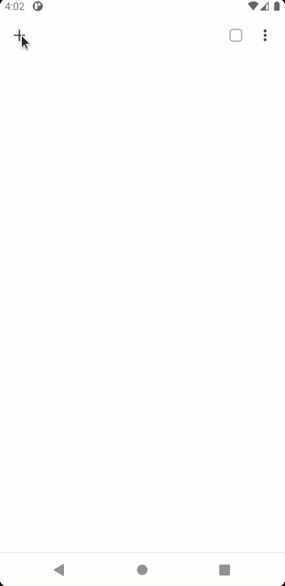
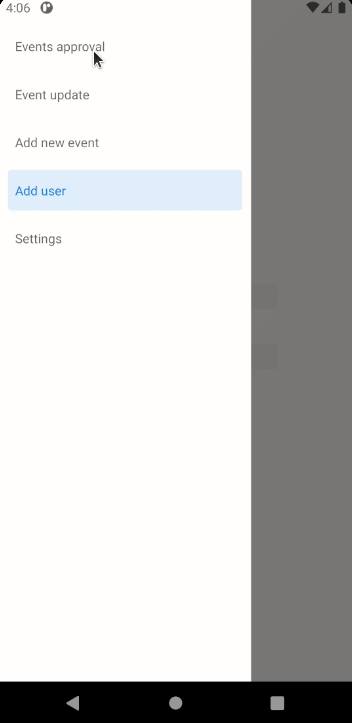
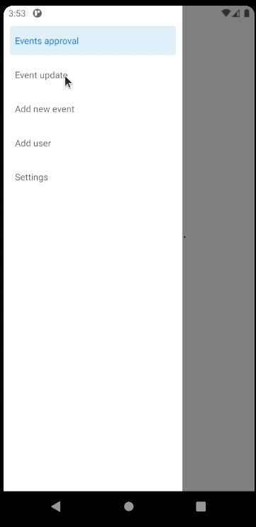
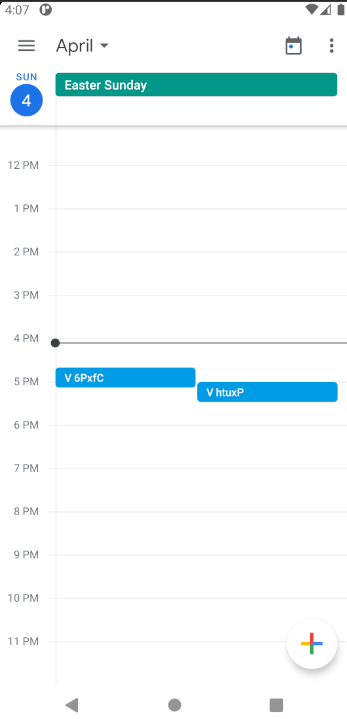
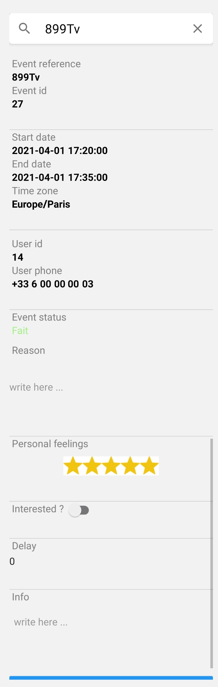

# Auto apartment tour app
An almost automatic web app to allow people to book a visit to your apartment (because you leave definitely it) without doing lots of things.

You just have to register users, add time slots for the visits and manually approve the bookings from a mobile app (Ios/Android). 
Then the app will automatically send SMS (with your current mobile phone number) and add the event to your calendar (which can be a sync calendar as Google calendar)

**User space**



**Manual approval**



**Add user**



**Autonomous calendar event adding**




**Change booking status**



# Installation

## Mobile

```
expo install
expo build:<platform>
```

where ```<platform>``` is either ``` android ``` or ``` ios ```.

Check the *releases* folder for latest update of the compile mobile app

## Web app

If you do not have php7.4 (on ubuntu) :

```
sudo apt-get update
sudo apt -y install software-properties-common
sudo add-apt-repository ppa:ondrej/php
sudo apt-get update
sudo apt-get install php7.4 php7.4-cli php7.4-fpm php7.4-json php7.4-common php7.4-mysql php7.4-zip php7.4-gd php7.4-mbstring php7.4-curl php7.4-xml php7.4-bcmath
```

```
sudo apt-get install composer
```

In the server root folder :

```
cat env.example > .env
```

Then edit the created file to match your configuration (DB_CONNECTION, DB_HOST, DB_PORT, DB_DATABASE, DB_USERNAME, DB_PASSWORD).

```
cat init.example.json > init.json
```

And as previously edit the created file to match your configuration.


Then check that your system uses the correct 7.4 version of php or run composer.phar with the php7.4 binary and run :
```
composer install
php artisan key:generate 
php artisan jwt:secret
php artisan migrate:fresh --seed
```

## Production mode
To run the laravel app in production mode (with apache2) if you cannot access the API roots edit the file at */etc/apache2/apache2.conf*, find the xml tag *<Directory /var/www/>* and change
*AllowOverride None* to *AllowOverride All*, then restart apache.

# Configuration

## Translations

The app has a little bit of language support built-in: the mobile app is entirely in English and the web app in French. 
To translate this app you will need to edit files and recompile it (the .js file for the mobile app and the .html file for the webapp).
This is far from perfect, but it has been developed mainly in a weekend so not all the desired feature has been implemented. 
Nonetheless, the messages send to users with SMS and the name of the status (of actions or event) have a translation file for that.

To add a new language named <full-name-lg> and shorten in <short-name-lg> create a new file at *resources/docs/msg/<short-name-lg>.json* that follow the structure :

```
{
    "action": {
        "book": {
            "validate": <msg to send to the user when you validate a booking that the user made>,
            "cancel": <msg to send to the user when you cancel a booking that the user made>
        },
        "unbook": {
            "validate": <msg to send to the user when you validate a booking cancellation that the user made>
        },
        "default": <default msg to send when there is no other message registered>
    },
    "registration": <msg to send to the user when you registered him>,
    "appendix_msg": <text to add at the end of all msg>
}
```

In this file you can use variable (``` {{variable-name}} ```) that will be filled up before the sending : 

- event.reference
- event.start_time
- event.end_time
- event.start_date
- event.end_date
- event.date
- localization.address : adress of your apartment
- localization.city_code
- localization.city_name
- localization.info
- action.reason : reason of the current action (validation/cancellation)
- timezone

Note that in the *registration* msg you can only use the following variables : 
- user.unencrypted_pwd
- user.login_url : url that replace the id/password for user
- server.url

Because the parsing of this model is made in the mobile app directly before sending the SMS for security/server structure reason (because of the unencrypted password)


Then you will need to add a file a line in *resources/docs/traductions.json* as follows :
``` 
{
    <short-name-lg>: { 
        "calendar": {
            "states": {
                "values": {
                    "abscence": {
                        "title": ...,
                        "color": "#f97356"
                    },
                    "cancelled": {
                        "title": ...,
                        "color": "#bdb4b1"
                    },
                    "not_allocated": {
                        "title":  "Libre",
                        "color": ""
                    },
                    "waiting_validation": {
                        "title": ...,
                        "color":  "#cb9eef"
                    },
                    "validated": {
                        "title": ...,
                        "color": "#f5cb71"
                    },
                    "done": {
                        "title": ...,
                        "color": "#a3f188"
                    },
                    "waiting_cancellation": {
                        "title": ...,
                        "color":  "#6f89e5"
                    }
                },
                "default": {
                    "title": "",
                    "color": ""
                }
            }
        },

        "actions": {
            "states" : {
                "values": {
                    "cancelled": {
                        "title": ...,
                        "color": "#f97356"
                    },
                    "waiting_validation": {
                        "title": ...,
                        "color": "#f5cb71"
                    },
                    "validated": {
                        "title": ...,
                        "color": "#a3f188"
                    }
                },
                "default": {
                    "title":  "",
                    "color": ""
                }
            },
            "types": {
                "values": {
                    "book": {
                        "title": ...
                    },
                    "unbook": {
                        "title": ...
                    },
                    "state_update": {
                        "title": ...
                    }
                }
            }
        }
    }
}
```

These values will be used to display event in the mobile app

And finally you need to add a line in *resources/docs/languages.json* as follows :
``` 
{
        "name": <full-name-lg>,
        "code": <short-name-lg>
}
```


## Login url

By default, each user can be logged in with a url (generated from a uuid4) except for the lodger/owner. This option can be disabled in the *.env* file with ``` LOGIN_WITH_URL=false ```
(you will need to restart the app in development mode and clear the cache/config in production mode)


# Working principle

The mobile app is the only tool that can be used to validate/cancel an action (booking/booking cancellation made by users),
add event (that can be booked), add new user and edit the status of a booking.

The web app is used by users, lodger and owner (that have different access).

You validate/cancel an action made to an event by a user. You never directly manipulate the event itself 
(except when you change it's status). Then in the lodger view you will see a table for the events 
and for the actions made to events.

Of course, users cannot access extra data (like his rank) and other booking not made by him.


# To do

Allow the cancellation of an event (booked or not) in the mobile app
